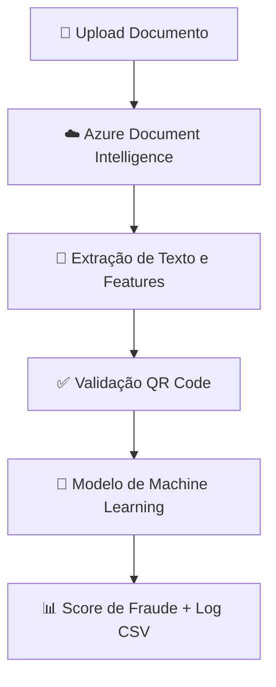

# 🔹 Document Fraud Detection with Azure AI & Machine Learning

<p align="center">
  
  
  
  
  
  
  
</p>

<p align="center">
  <a href="https://github.com/Ronbragaglia/An-lise-Automatizada-de-Documentos-com-Azure-AI-e-Machine-Learning/stargazers">
    
  </a>
  <a href="https://github.com/Ronbragaglia/An-lise-Automatizada-de-Documentos-com-Azure-AI-e-Machine-Learning/forks">
    
  </a>
  <a href="https://github.com/Ronbragaglia/An-lise-Automatizada-de-Documentos-com-Azure-AI-e-Machine-Learning/issues">
    
  </a>
</p>

---

## 📌 Sobre o Projeto

🚀 Este projeto implementa uma **solução completa de análise de documentos** para **detecção de fraudes**, combinando tecnologias modernas de Inteligência Artificial e Machine Learning:

- **Azure AI Document Intelligence (Form Recognizer)** para extração de texto
- **Machine Learning (Random Forest)** para score de fraude
- **Verificação de autenticidade via QR Code**
- **Geração de logs CSV para auditoria e compliance**

### 🎯 Características Principais

- ✅ Extração automática de texto de documentos
- ✅ Detecção de QR Codes para verificação de autenticidade
- ✅ Classificação de documentos como autênticos ou suspeitos
- ✅ Score de fraude (0-1) para análise de risco
- ✅ Logging detalhado em CSV para auditoria
- ✅ Suporte a múltiplos formatos de imagem
- ✅ Interface de linha de comando (CLI) completa
- ✅ API Python modular e extensível
- ✅ Suporte a Docker para fácil deploy
- ✅ Testes automatizados com pytest
- ✅ Documentação completa

### 🏢 Casos de Uso

- **Bancos e Instituições Financeiras**: Validação de documentos de clientes
- **Seguros**: Verificação de apólices e comprovantes
- **RH**: Validação de documentos de candidatos
- **Compliance**: Auditoria e conformidade regulatória
- **Governo**: Validação de documentos oficiais

---

## 🛠 Tecnologias Utilizadas

### Core
- **Python 3.9+**: Linguagem principal
- **Azure AI Document Intelligence**: Extração de texto
- **Scikit-learn**: Machine Learning (Random Forest)
- **OpenCV + Pyzbar**: Detecção de QR Codes
- **Pandas**: Tratamento de dados e logs

### Desenvolvimento
- **pytest**: Framework de testes
- **Black**: Formatação de código
- **flake8**: Verificação de estilo
- **mypy**: Verificação de tipos
- **pre-commit**: Hooks de Git

### Deploy
- **Docker**: Containerização
- **Docker Compose**: Orquestração de containers

---

## ⚡ Pipeline da Solução



---

## 🚀 Começando Rápido

### Pré-requisitos

- Python 3.9 ou superior
- Conta do Azure com recurso Form Recognizer
- pip (gerenciador de pacotes Python)

### Instalação

```bash
# Clone o repositório
git clone https://github.com/Ronbragaglia/An-lise-Automatizada-de-Documentos-com-Azure-AI-e-Machine-Learning.git
cd An-lise-Automatizada-de-Documentos-com-Azure-AI-e-Machine-Learning

# Crie um ambiente virtual
python -m venv venv
source venv/bin/activate  # Linux/Mac
# ou
venv\Scripts\activate  # Windows

# Instale as dependências
pip install -r requirements.txt

# Configure o Azure
cp .env.example .env
# Edite o .env com suas credenciais
```

### Uso Básico

```bash
# Analisar um documento
python -m src.cli analyze documento.pdf

# Analisar todos os documentos de um diretório
python -m src.cli analyze-dir ./data

# Ver estatísticas
python -m src.cli stats
```

### Uso como Biblioteca

```python
from src.detector import FraudDetector
from src.logger import FraudDetectionLogger

# Inicializar detector
detector = FraudDetector()

# Detectar fraude
result = detector.detect("documento.pdf")

# Exibir resultado
print(f"Score de Fraude: {result['fraud_score']:.2f}")
print(f"Classificação: {result['classification']}")

# Logar resultado
logger = FraudDetectionLogger()
logger.log_detection(result)
logger.log_to_csv(result)
```

---

## 📚 Documentação

- 📖 [Guia de Instalação](docs/installation.md) - Instruções detalhadas de instalação
- 📖 [Guia de Uso](docs/usage.md) - Exemplos e tutoriais
- 📖 [API Reference](docs/api-reference.md) - Documentação completa da API
- 📖 [Arquitetura](docs/architecture.md) - Detalhes técnicos do sistema
- 📖 [FAQ](docs/faq.md) - Perguntas frequentes
- 📖 [Contribuindo](CONTRIBUTING.md) - Como contribuir com o projeto

---

## 🧪 Testes

```bash
# Executar todos os testes
pytest

# Executar com coverage
pytest --cov=src --cov-report=html

# Executar apenas testes unitários
pytest -m unit
```

---

## 🐳 Docker

### Usando Docker Compose

```bash
# Construir e executar
docker-compose up -d

# Ver logs
docker-compose logs -f

# Parar
docker-compose down
```

### Usando Dockerfile

```bash
# Construir imagem
docker build -t document-fraud-detection .

# Executar container
docker run -it --rm \
  -v $(pwd)/data:/app/data \
  -v $(pwd)/output:/app/output \
  -e AZURE_FORM_RECOGNIZER_KEY=sua-chave \
  -e AZURE_FORM_RECOGNIZER_ENDPOINT=https://seu-endpoint \
  document-fraud-detection
```

---

## 📁 Estrutura do Projeto

```
.
├── src/                    # Código fonte
│   ├── detector.py         # Detector de fraudes
│   ├── document_analyzer.py # Analisador de documentos
│   ├── qr_verifier.py      # Verificador de QR Codes
│   ├── logger.py          # Sistema de logging
│   ├── config.py          # Configurações
│   └── cli.py             # Interface CLI
├── tests/                  # Testes automatizados
├── examples/               # Exemplos de uso
├── docs/                   # Documentação
├── data/                   # Dados de entrada
├── models/                 # Modelos treinados
├── logs/                   # Logs do sistema
└── output/                 # Saída de resultados
```

---

## 🤝 Contribuindo

Contribuições são bem-vindas! Por favor, leia o [Guia de Contribuição](CONTRIBUTING.md) antes de começar.

### Como Contribuir

1. Fork o repositório
2. Crie uma branch para sua feature (`git checkout -b feature/MinhaFeature`)
3. Commit suas mudanças (`git commit -m 'feat: Adiciona nova feature'`)
4. Push para a branch (`git push origin feature/MinhaFeature`)
5. Abra um Pull Request

---

## 📄 Licença

Este projeto está licenciado sob a licença MIT - veja o arquivo [LICENSE](LICENSE) para detalhes.

---

## 👤 Autor

**Rone Bragaglia**

- GitHub: [@Ronbragaglia](https://github.com/Ronbragaglia)
- LinkedIn: [Rone Bragaglia](https://linkedin.com/in/ronbragaglia)

---

## 🙏 Agradecimentos

- Azure AI pela excelente API de Document Intelligence
- Scikit-learn pelo framework de Machine Learning
- OpenCV pela biblioteca de visão computacional
- Comunidade open-source pelas ferramentas e bibliotecas

---

## 📞 Suporte

Se você encontrar algum problema ou tiver dúvidas:

1. Verifique a [FAQ](docs/faq.md)
2. Consulte a [Documentação](docs/)
3. Abra uma [issue](https://github.com/Ronbragaglia/An-lise-Automatizada-de-Documentos-com-Azure-AI-e-Machine-Learning/issues)

---

## 🔗 Links Úteis

- [Repositório GitHub](https://github.com/Ronbragaglia/An-lise-Automatizada-de-Documentos-com-Azure-AI-e-Machine-Learning)
- [Azure Document Intelligence](https://azure.microsoft.com/en-us/services/ai-services/form-recognizer/)
- [Scikit-learn](https://scikit-learn.org/)
- [OpenCV](https://opencv.org/)

---

<p align="center">
  <b>⭐ Se este projeto foi útil para você, considere dar uma estrela! ⭐</b>
</p>
