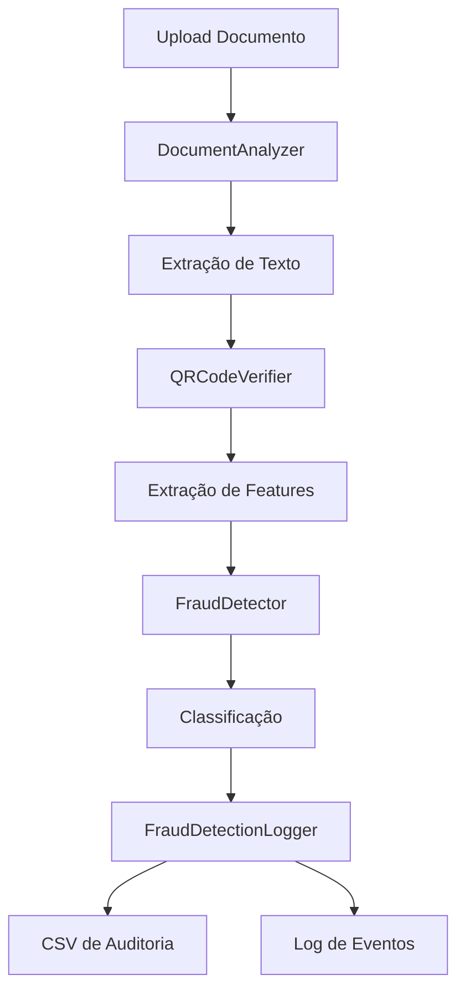

# Arquitetura do Sistema

Este documento descreve a arquitetura técnica do sistema de detecção de fraudes em documentos.

## 📋 Índice

- [Visão Geral](#visão-geral)
- [Componentes Principais](#componentes-principais)
- [Fluxo de Dados](#fluxo-de-dados)
- [Estrutura de Diretórios](#estrutura-de-diretórios)
- [Design Patterns](#design-patterns)
- [Considerações de Performance](#considerações-de-performance)
- [Segurança](#segurança)

## 🎯 Visão Geral

O sistema é composto por vários componentes que trabalham juntos para detectar fraudes em documentos:

```
┌─────────────────┐
│   Documento    │
│   (PDF/IMG)    │
└────────┬────────┘
         │
         ▼
┌─────────────────────────────────────────┐
│    DocumentAnalyzer (Azure AI)        │
│  - Extração de Texto               │
│  - Análise de Estrutura           │
└────────┬────────────────────────────┘
         │
         ▼
┌─────────────────────────────────────────┐
│    QRCodeVerifier (OpenCV)          │
│  - Detecção de QR Codes           │
│  - Validação de Autenticidade      │
└────────┬────────────────────────────┘
         │
         ▼
┌─────────────────────────────────────────┐
│  Feature Extraction                 │
│  - Tamanho do Texto               │
│  - Presença de QR Code            │
│  - Palavras Suspeitas            │
└────────┬────────────────────────────┘
         │
         ▼
┌─────────────────────────────────────────┐
│  FraudDetector (ML Model)          │
│  - Random Forest Classifier         │
│  - Score de Fraude                │
│  - Classificação                  │
└────────┬────────────────────────────┘
         │
         ▼
┌─────────────────────────────────────────┐
│  FraudDetectionLogger              │
│  - Logging de Resultados           │
│  - Auditoria em CSV              │
│  - Estatísticas                  │
└─────────────────────────────────────────┘
```

## 🧩 Componentes Principais

### 1. DocumentAnalyzer

**Responsabilidade**: Extração de texto e análise de documentos usando Azure AI.

**Tecnologias**:
- Azure AI Document Intelligence (Form Recognizer)
- Python SDK do Azure

**Funcionalidades**:
- Extração de texto de documentos
- Análise de estrutura do documento
- Extração de características
- Processamento em lote

**Arquivo**: [`src/document_analyzer.py`](../src/document_analyzer.py)

### 2. QRCodeVerifier

**Responsabilidade**: Detecção e verificação de QR Codes.

**Tecnologias**:
- OpenCV
- pyzbar

**Funcionalidades**:
- Detecção de QR Codes
- Extração de dados do QR Code
- Validação de tamanho
- Contagem de QR Codes

**Arquivo**: [`src/qr_verifier.py`](../src/qr_verifier.py)

### 3. FraudDetector

**Responsabilidade**: Classificação de documentos como autênticos ou fraudulentos.

**Tecnologias**:
- Scikit-learn
- Random Forest Classifier
- Joblib (para persistência do modelo)

**Funcionalidades**:
- Treinamento do modelo
- Predição de fraude
- Avaliação do modelo
- Análise de importância de características

**Arquivo**: [`src/detector.py`](../src/detector.py)

### 4. FraudDetectionLogger

**Responsabilidade**: Logging e auditoria de detecções.

**Tecnologias**:
- Python logging module
- Pandas
- CSV

**Funcionalidades**:
- Logging de detecções
- Auditoria em CSV
- Estatísticas
- Histórico de detecções

**Arquivo**: [`src/logger.py`](../src/logger.py)

### 5. Config

**Responsabilidade**: Gerenciamento de configurações do sistema.

**Tecnologias**:
- python-dotenv
- pathlib

**Funcionalidades**:
- Carregamento de variáveis de ambiente
- Validação de configuração
- Gerenciamento de caminhos
- Criação de diretórios

**Arquivo**: [`src/config.py`](../src/config.py)

### 6. CLI (Command Line Interface)

**Responsabilidade**: Interface de linha de comando para usuários.

**Tecnologias**:
- argparse
- Python CLI padrão

**Funcionalidades**:
- Análise de documentos
- Análise em lote
- Treinamento de modelo
- Estatísticas
- Gerenciamento de logs

**Arquivo**: [`src/cli.py`](../src/cli.py)

## 🔄 Fluxo de Dados

### Fluxo de Detecção de Fraude



### Passo a Passo

1. **Upload do Documento**
   - Usuário fornece o caminho do arquivo
   - Sistema valida o formato do arquivo

2. **Análise do Documento**
   - `DocumentAnalyzer` extrai texto usando Azure AI
   - Sistema obtém características do documento

3. **Verificação de QR Code**
   - `QRCodeVerifier` detecta QR Codes na imagem
   - Sistema valida a presença de QR Code

4. **Extração de Features**
   - Sistema calcula características:
     - Tamanho do texto
     - Presença de QR Code
     - Palavras suspeitas

5. **Detecção de Fraude**
   - `FraudDetector` aplica o modelo ML
   - Sistema calcula score de fraude
   - Sistema classifica documento

6. **Logging**
   - `FraudDetectionLogger` registra resultado
   - Sistema salva em CSV para auditoria
   - Sistema atualiza estatísticas

## 📁 Estrutura de Diretórios

```
An-lise-Automatizada-de-Documentos-com-Azure-AI-e-Machine-Learning/
├── src/                          # Código fonte
│   ├── __init__.py               # Inicialização do pacote
│   ├── config.py                 # Configurações do sistema
│   ├── detector.py               # Detector de fraudes
│   ├── document_analyzer.py      # Analisador de documentos
│   ├── qr_verifier.py           # Verificador de QR Codes
│   ├── logger.py                # Sistema de logging
│   └── cli.py                  # Interface de linha de comando
├── tests/                        # Testes
│   ├── __init__.py
│   ├── conftest.py              # Fixtures para testes
│   ├── test_detector.py          # Testes do detector
│   └── test_logger.py           # Testes do logger
├── examples/                     # Exemplos de uso
│   ├── __init__.py
│   ├── basic_usage.py           # Uso básico
│   └── advanced_usage.py        # Uso avançado
├── docs/                         # Documentação
│   ├── index.md                 # Página inicial
│   ├── installation.md          # Guia de instalação
│   ├── usage.md                # Guia de uso
│   ├── api-reference.md         # Referência da API
│   ├── architecture.md          # Arquitetura (este arquivo)
│   └── faq.md                 # Perguntas frequentes
├── data/                         # Dados de entrada
│   └── .gitkeep
├── models/                       # Modelos treinados
│   └── .gitkeep
├── logs/                         # Logs do sistema
│   └── .gitkeep
├── output/                       # Saída de resultados
│   └── .gitkeep
├── .env.example                  # Exemplo de configuração
├── .gitignore                   # Arquivos ignorados pelo Git
├── requirements.txt              # Dependências Python
├── pyproject.toml              # Configuração do projeto
├── Dockerfile                   # Configuração Docker
├── docker-compose.yml           # Compose Docker
├── Makefile                    # Automação de tarefas
├── LICENSE                     # Licença MIT
├── README.md                   # Documentação principal
├── CONTRIBUTING.md             # Guia de contribuição
└── CHANGELOG.md               # Histórico de mudanças
```

## 🎨 Design Patterns

### 1. Strategy Pattern

O `FraudDetector` usa diferentes estratégias de classificação baseadas no threshold configurado.

### 2. Factory Pattern

A classe `Config` atua como uma factory para criar configurações e caminhos.

### 3. Observer Pattern

O `FraudDetectionLogger` observa as detecções e registra automaticamente.

### 4. Singleton Pattern

A classe `Config` usa uma instância global para gerenciar configurações.

## ⚡ Considerações de Performance

### Otimizações Implementadas

1. **Batch Processing**
   - Suporte para processamento em lote de documentos
   - Reduz overhead de inicialização

2. **Model Persistence**
   - Modelo treinado é salvo em disco
   - Evita retreinamento desnecessário

3. **Lazy Loading**
   - Componentes são inicializados apenas quando necessário
   - Reduz uso de memória

4. **Efficient Logging**
   - Logging assíncrono para não bloquear operações
   - Buffering de logs em CSV

### Recomendações de Performance

1. **Para Grandes Volumes**
   - Use `batch_detect()` em vez de múltiplas chamadas `detect()`
   - Processe documentos em paralelo se possível

2. **Para Alta Disponibilidade**
   - Implemente cache de modelos
   - Use balanceamento de carga

3. **Para Latência Baixa**
   - Pré-carregue o modelo em memória
   - Use GPU se disponível

## 🔒 Segurança

### Medidas de Segurança

1. **Proteção de Credenciais**
   - Credenciais do Azure em variáveis de ambiente
   - `.env` no `.gitignore`
   - `.env.example` para documentação

2. **Validação de Entrada**
   - Validação de caminhos de arquivos
   - Verificação de formatos suportados
   - Sanitização de nomes de arquivos

3. **Logging Seguro**
   - Sem logging de dados sensíveis
   - Logs em formato estruturado
   - Rotação de logs

4. **Autenticação Azure**
   - Uso de Azure Key Credential
   - Validação de endpoint
   - Tratamento de erros de autenticação

### Boas Práticas de Segurança

1. **Nunca** commit credenciais no repositório
2. **Sempre** use HTTPS para endpoints do Azure
3. **Implemente** rate limiting para APIs
4. **Use** tokens de acesso temporários quando possível
5. **Monitore** logs de acesso e erros

## 🚀 Escalabilidade

### Horizontal Scaling

- Stateless design permite múltiplas instâncias
- Load balancing com nginx ou similar
- Shared storage para modelos e logs

### Vertical Scaling

- Suporte a GPU para inferência ML
- Aumento de memória para grandes batches
- SSD para I/O rápido

### Cloud Deployment

- Containerização com Docker
- Orquestração com Kubernetes
- Auto-scaling baseado em demanda

## 📊 Monitoramento

### Métricas Importantes

1. **Performance**
   - Tempo de processamento por documento
   - Taxa de throughput
   - Uso de CPU e memória

2. **Qualidade**
   - Acurácia do modelo
   - Taxa de falsos positivos/negativos
   - Score médio de fraude

3. **Disponibilidade**
   - Uptime do serviço
   - Taxa de erros
   - Tempo de resposta

### Ferramentas Recomendadas

- Prometheus para métricas
- Grafana para visualização
- ELK Stack para logs
- Sentry para error tracking

---

**Versão**: 1.0.0 | **Última Atualização**: 2025
